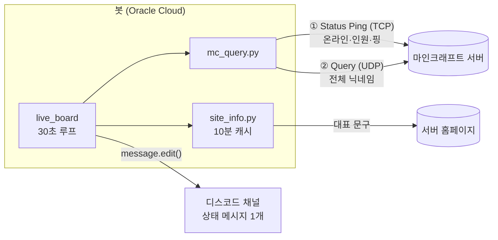

# 🟢 Minecraft Server Status Bot

마인크래프트 서버의 실시간 접속 현황을 디스코드 채널에 **메시지 하나로** 계속 보여주는 봇입니다.
새 메시지를 쌓지 않고 같은 메시지를 30초마다 수정하기 때문에 채널이 깔끔하게 유지됩니다.

<!-- 스크린샷을 docs/preview.png 로 저장한 뒤 주석을 풀어주세요
<p align="center">
  
</p>
-->

실제 운영 중인 마인크래프트 1.20.1 서버(최대 20명)에 붙여 Oracle Cloud에서 24시간 돌리고 있습니다.

## 주요 기능

- **실시간 상태 보드** — 채널에 올린 메시지 하나를 주기적으로 수정. 봇을 재시작해도 같은 메시지를 이어서 갱신
- **접속자 전체 닉네임** — Query 프로토콜로 전원 조회, 불가능하면 Status Ping으로 자동 전환
- **익명 플레이어 처리** — 서버 목록 표시를 끈 플레이어를 정확한 인원수로 표시
- **홈페이지 연동** — 서버 홈페이지의 대표 문구를 읽어와 표시하고, 클릭 가능한 링크 제공
- **봇 프로필 상태** — `플레이 중 6명 온라인` 형태로 실시간 반영
- **장애 내성** — 마인크래프트 서버·홈페이지·디스코드 API 어느 쪽이 실패해도 갱신 루프가 멈추지 않음
- **진단 도구** — 채널 권한과 서버 조회 상태를 단독으로 점검하는 스크립트 포함

## 기술 스택

| 분류 | 사용 |
|---|---|
| 언어 | Python 3.10+ (asyncio) |
| 디스코드 | [discord.py](https://github.com/Rapptz/discord.py) 2.x — 슬래시 커맨드, `tasks.loop` |
| 마인크래프트 조회 | [mcstatus](https://github.com/py-mine/mcstatus) — Server List Ping, Query |
| HTTP | aiohttp |
| 배포 | Oracle Cloud Always Free (Ubuntu 24.04), systemd |

## 동작 구조



| 파일 | 역할 |
|---|---|
| `bot.py` | 디스코드 연결, 상태 보드 갱신 루프, 임베드 구성, `/status` 커맨드 |
| `mc_query.py` | 서버 조회. Status Ping으로 기본 정보를 받고 Query로 전체 명단을 보강 |
| `site_info.py` | 홈페이지 대표 문구 추출 및 캐시 |
| `diag.py` | 봇의 채널 권한을 단계별로 진단 |
| `deploy/` | systemd 서비스 파일 |
| `run_bot.bat` | Windows 로컬 실행용 (종료 시 자동 재시작) |

## 개발하면서 해결한 문제들

### 1. 같은 이름의 익명 플레이어가 한 명으로 합쳐지는 버그

접속 인원은 6명인데 목록에는 5명만 표시됐습니다. 서버 응답을 직접 찍어보니 6명이 모두 오고 있었고,
그중 2명이 `Anonymous Player`라는 **같은 이름**이었습니다. 게임 설정에서 서버 목록 표시를 끄면
이름과 UUID(`00000000-…`)가 모두 가려진 채로 내려오는데, 중복 닉네임을 `set`으로 거르면서
서로 다른 두 사람이 하나로 합쳐진 것이었습니다.

이름 대신 **UUID로 익명 여부를 판별하고 인원수를 따로 세도록** 바꿔 `4명 + 익명 2명`으로 정확히 표시되게 했습니다.

### 2. 한 번도 실행된 적 없는 코드가 운영 중에 루프를 멈춘 문제

서버 관리자가 Query를 켜자마자 상태 보드가 `오프라인`에 멈춰버렸습니다.
Query 결과의 속성 이름을 잘못 쓰고 있었는데(`players.names` → 실제로는 `players.list`),
그전까지 Query가 꺼져 있어 **이 경로가 한 번도 실행되지 않아** 드러나지 않았던 것입니다.

더 큰 문제는 이 예외 하나로 `tasks.loop`가 **조용히 종료**됐다는 점입니다.
프로세스는 살아 있어서 systemd의 자동 재시작도 작동하지 않았습니다. 두 가지를 고쳤습니다.

- 응답 해석까지 `try` 안으로 옮겨, 형식이 달라도 Status Ping으로 폴백
- 루프 본문 전체를 감싸 **어떤 예외가 나도 로그만 남기고 다음 주기에 재시도**

### 3. TPS를 표시하지 않기로 한 이유

서버 성능 지표로 TPS를 보여달라는 요청이 있었습니다. 하지만 TPS는 Status Ping과 Query 어디에도 없고,
**RCON**으로 콘솔 명령을 실행해야만 얻을 수 있습니다.

| 항목 | 평가 |
|---|---|
| 서버 부하 | 문제 없음 — 이미 측정 중인 값을 읽을 뿐 |
| 비용 | 문제 없음 — 요청당 수백 바이트 |
| 보안 | **문제 있음** — RCON은 비밀번호를 평문으로 보내고, 뚫리면 서버 콘솔 전체 권한을 넘겨줌 |

봇이 외부 클라우드에 있어 RCON 포트를 인터넷에 열어야 했기 때문에, 지표 하나를 위해 감수할 위험이 아니라고 판단했습니다.
대신 기존에 `응답 속도`로 표시하던 값이 **서버 성능이 아니라 네트워크 왕복 시간**이라는 점을 필드 이름(`핑`)과
푸터에 명시해 오해를 막았습니다. 필요해지면 Tailscale 같은 암호화 사설망을 거쳐 RCON을 쓰는 방향을 검토할 예정입니다.

### 4. API가 없는 홈페이지에서 문구 가져오기

홈페이지(Next.js)에 JSON API가 없어 페이지에 포함된 데이터(`heroHighlight`)를 정규식으로 추출합니다.
외부 사이트 구조에 의존하는 방식이라 실패를 전제로 설계했습니다.

1. **캐시 (10분)** — 30초마다 홈페이지에 요청하지 않음
2. **마지막 성공값 유지** — 홈페이지가 잠시 죽어도 표시가 바뀌지 않음
3. **MOTD 폴백** — 한 번도 못 가져왔으면 서버 기본 문구 사용

### 5. 권한을 줬는데도 메시지를 못 보내는 문제

채널 권한에 봇 역할을 추가했는데도 계속 `Forbidden`이 났습니다. 권한을 단계별로 출력하는 `diag.py`를 만들어 확인하니,
봇 역할 항목은 추가만 되고 값이 **상속(미지정)** 상태였고, 채널의 `@everyone`에 걸린 **메시지 보내기 거부**를 그대로 물려받고 있었습니다.
채널 덮어쓰기는 역할 자체 권한보다 우선하기 때문에 봇 역할에 서버 전체 권한이 있어도 소용이 없었습니다.

## 설치 및 실행

### 1. 디스코드 봇 만들기

1. [Discord Developer Portal](https://discord.com/developers/applications) → **New Application** → **Bot** 탭에서 토큰 발급
2. **OAuth2 → URL Generator**
   - Scopes: `bot`, `applications.commands`
   - Permissions: `View Channels`, `Send Messages`, `Embed Links`, `Read Message History`
3. 생성된 URL로 서버에 초대

> 상태 보드 채널이 `@everyone` 메시지 보내기를 막아두었다면, 채널 권한에서 봇 역할의 **메시지 보내기**와 **링크 첨부**를 명시적으로 허용해야 합니다.

### 2. 마인크래프트 서버 설정 (전체 닉네임용, 권장)

`server.properties`

```properties
enable-query=true
query.port=25565
```

서버를 재시작하고 방화벽·공유기에서 **UDP 25565**를 엽니다. 설정하지 않아도 봇은 동작하지만 닉네임이 일부만 표시될 수 있습니다.

### 3. 실행

```bash
git clone https://github.com/wwermmlk/mc-status-bot.git
cd mc-status-bot
pip install -r requirements.txt
cp .env.example .env   # 값 채우기
python bot.py
```

실행 전에 서버 조회만 따로 확인할 수 있습니다.

```bash
python mc_query.py   # "조회 방식 : query" 가 나오면 Query 설정 정상
python diag.py       # 봇의 채널 권한 점검
```

## 설정

| 변수 | 필수 | 설명 |
|---|:---:|---|
| `DISCORD_TOKEN` | ✅ | 봇 토큰 |
| `STATUS_CHANNEL_ID` | ✅ | 상태 보드를 올릴 채널 |
| `MC_HOST` | ✅ | 마인크래프트 서버 주소 |
| `MC_PORT` / `MC_QUERY_PORT` | | 기본 `25565` |
| `GUILD_ID` | | 넣으면 슬래시 커맨드가 즉시 등록됨 |
| `UPDATE_INTERVAL` | | 갱신 주기(초), 기본 `30`, 최소 `15` |
| `PRESENCE_UPDATE` | | 봇 프로필 상태 표시, 기본 `true` |
| `BOT_LOCATION` | | 핑을 잰 위치 표기, 기본 `오사카` |
| `SITE_URL` | | 홈페이지 주소. 비우면 서버 MOTD 사용 |
| `SITE_LINK_TEXT` | | 임베드 링크 문구, 기본 `🏡 서버 홈페이지` |
| `SITE_CACHE_SECONDS` | | 홈페이지 캐시 시간, 기본 `600` |
| `BOT_DESCRIPTION` | | 봇 프로필 설명. 비우면 변경하지 않음 |

## 배포 (Oracle Cloud Always Free)

`VM.Standard.E2.1.Micro`(1GB) 인스턴스 하나로 충분합니다. 봇은 메모리를 50MB 남짓 사용합니다.

```bash
sudo apt install -y python3-venv
cd ~/mc-status-bot
python3 -m venv venv
./venv/bin/pip install -r requirements.txt

sudo cp deploy/mc-status-bot.service /etc/systemd/system/
sudo systemctl enable --now mc-status-bot
```

서비스 파일은 `ubuntu` 사용자와 `/home/ubuntu/mc-status-bot` 경로를 기준으로 되어 있으니 환경에 맞게 수정하세요.
`Restart=always`로 되어 있어 크래시나 서버 재부팅 후에도 자동으로 다시 켜집니다.

```bash
sudo journalctl -u mc-status-bot -f   # 실시간 로그
```

> 로컬에서 테스트하던 봇의 `.bot_state.json`을 함께 옮기면 기존 상태 메시지를 그대로 이어받습니다. 두 곳에서 동시에 실행하면 같은 메시지를 서로 덮어쓰니 한쪽만 켜두세요.

## 라이선스

[MIT](LICENSE)
