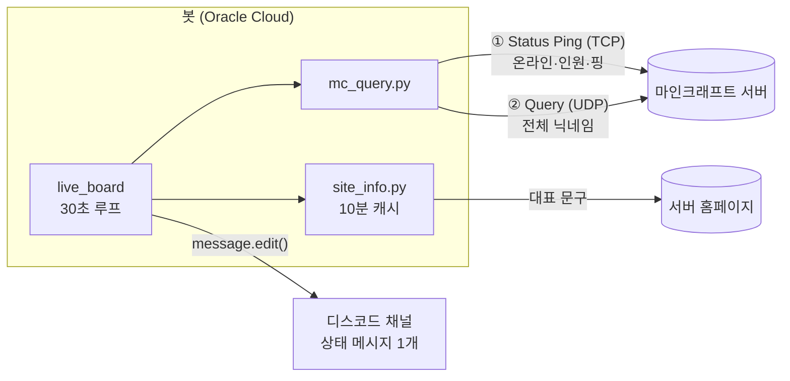
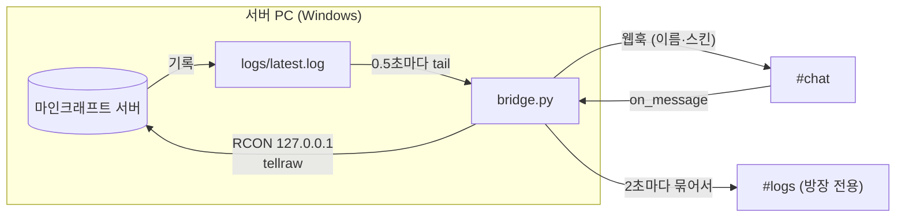

# 🟢 Minecraft Server Status Bot

마인크래프트 서버와 디스코드를 잇는 두 개의 봇입니다.

- **상태 봇** (`bot.py`, 클라우드) — 실시간 접속 현황을 채널에 **메시지 하나로** 계속 보여줍니다. 새 메시지를 쌓지 않고 같은 메시지를 30초마다 수정해 채널이 깔끔하게 유지됩니다.
- **채팅 브리지** (`bridge.py`, 서버 PC) — 게임 채팅과 디스코드 채널을 양방향으로 잇고, 서버 콘솔 로그를 방장 전용 채널로 실시간 전송합니다.

<!-- 스크린샷을 docs/preview.png 로 저장한 뒤 주석을 풀어주세요
<p align="center">
  
</p>
-->

실제 운영 중인 마인크래프트 1.20.1 서버(최대 20명)에 붙여 Oracle Cloud에서 24시간 돌리고 있습니다.

## 주요 기능

### 채팅 브리지

- **게임 → 디스코드** — 채팅을 플레이어 이름·스킨 아바타로, 발생 시각(`[00:18:37]`)과 함께 표시. 접속·퇴장·사망·서버 켜짐/꺼짐 알림
- **`/채팅날짜`** — 관리자가 시각에 날짜(`[2026-09-18 00:18:37]`)를 붙일지 켜고 끔. 설정은 재시작 후에도 유지
- **디스코드 → 게임** — 게임 채팅에 <code>[Discord]</code>(디스코드 브랜드 색 `#5865F2`) `닉네임: 메시지`로 표시. 서버가 꺼져 있으면 ❌ 반응으로 실패 안내
- **콘솔 로그 채널** — 서버 콘솔 전체를 묶어서 실시간 전송. 채널이 공개 상태면 전송을 스스로 거부하고, 플레이어 IP는 가림
- **명령 주입 방어** — 디스코드 입력을 JSON 직렬화로만 명령에 넣고 색 코드·줄바꿈 제거
- **RCON 직접 구현** — 외부 라이브러리 없이 asyncio로 프로토콜 구현, 같은 PC 안에서만 사용

### 상태 봇

- **실시간 상태 보드** — 채널에 올린 메시지 하나를 주기적으로 수정. 봇을 재시작해도 같은 메시지를 이어서 갱신
- **접속자 전체 닉네임** — Query 프로토콜로 전원 조회, 불가능하면 Status Ping으로 자동 전환
- **익명 플레이어 처리** — 서버 목록 표시를 끈 플레이어를 정확한 인원수로 표시
- **홈페이지 연동** — 서버 홈페이지의 대표 문구를 읽어와 표시하고, 클릭 가능한 링크 제공
- **봇 프로필 상태** — `플레이 중 6명 온라인` 형태로 실시간 반영
- **장애 내성** — 마인크래프트 서버·홈페이지·디스코드 API 어느 쪽이 실패해도 갱신 루프가 멈추지 않음
- **진단 도구** — 채널 권한과 서버 조회 상태를 단독으로 점검하는 스크립트 포함

## 기술 스택

| 분류 | 사용 |
|---|---|
| 언어 | Python 3.10+ (asyncio) |
| 디스코드 | [discord.py](https://github.com/Rapptz/discord.py) 2.x — 슬래시 커맨드, `tasks.loop` |
| 마인크래프트 조회 | [mcstatus](https://github.com/py-mine/mcstatus) — Server List Ping, Query |
| HTTP | aiohttp |
| 배포 | Oracle Cloud Always Free (Ubuntu 24.04), systemd |

## 동작 구조

### 상태 봇



### 채팅 브리지



| 파일 | 역할 |
|---|---|
| `bot.py` | 상태 봇. 디스코드 연결, 상태 보드 갱신 루프, 임베드 구성, `/status` 커맨드 |
| `mc_query.py` | 서버 조회. Status Ping으로 기본 정보를 받고 Query로 전체 명단을 보강 |
| `site_info.py` | 홈페이지 대표 문구 추출 및 캐시 |
| `bridge.py` | 채팅 브리지. 이벤트 라우팅, 전송 큐, #logs 공개 여부 검사 |
| `mc_log.py` | `latest.log` 실시간 추적(로그 교체 감지) + 줄 파서(채팅·접속·사망 등 분류) |
| `mc_text.py` | 디스코드 메시지 → `tellraw` 명령 안전 변환 |
| `rcon.py` | 비동기 RCON 클라이언트 |
| `diag.py` | 봇의 채널 권한을 단계별로 진단 (`python diag.py bridge`로 브리지 채널 점검) |
| `tests/` | 파서·변환기·RCON·메시지 형식 단위 테스트 |
| `deploy/` | systemd 서비스 파일 |
| `run_bot.bat`, `run_bridge.bat` | Windows 실행용 (종료 시 자동 재시작) |

## 개발하면서 해결한 문제들

### 1. 같은 이름의 익명 플레이어가 한 명으로 합쳐지는 버그

접속 인원은 6명인데 목록에는 5명만 표시됐습니다. 서버 응답을 직접 찍어보니 6명이 모두 오고 있었고,
그중 2명이 `Anonymous Player`라는 **같은 이름**이었습니다. 게임 설정에서 서버 목록 표시를 끄면
이름과 UUID(`00000000-…`)가 모두 가려진 채로 내려오는데, 중복 닉네임을 `set`으로 거르면서
서로 다른 두 사람이 하나로 합쳐진 것이었습니다.

이름 대신 **UUID로 익명 여부를 판별하고 인원수를 따로 세도록** 바꿔 `4명 + 익명 2명`으로 정확히 표시되게 했습니다.

### 2. 한 번도 실행된 적 없는 코드가 운영 중에 루프를 멈춘 문제

서버 관리자가 Query를 켜자마자 상태 보드가 `오프라인`에 멈춰버렸습니다.
Query 결과의 속성 이름을 잘못 쓰고 있었는데(`players.names` → 실제로는 `players.list`),
그전까지 Query가 꺼져 있어 **이 경로가 한 번도 실행되지 않아** 드러나지 않았던 것입니다.

더 큰 문제는 이 예외 하나로 `tasks.loop`가 **조용히 종료**됐다는 점입니다.
프로세스는 살아 있어서 systemd의 자동 재시작도 작동하지 않았습니다. 두 가지를 고쳤습니다.

- 응답 해석까지 `try` 안으로 옮겨, 형식이 달라도 Status Ping으로 폴백
- 루프 본문 전체를 감싸 **어떤 예외가 나도 로그만 남기고 다음 주기에 재시도**

### 3. TPS를 표시하지 않기로 한 이유

서버 성능 지표로 TPS를 보여달라는 요청이 있었습니다. 하지만 TPS는 Status Ping과 Query 어디에도 없고,
**RCON**으로 콘솔 명령을 실행해야만 얻을 수 있습니다.

| 항목 | 평가 |
|---|---|
| 서버 부하 | 문제 없음 — 이미 측정 중인 값을 읽을 뿐 |
| 비용 | 문제 없음 — 요청당 수백 바이트 |
| 보안 | **문제 있음** — RCON은 비밀번호를 평문으로 보내고, 뚫리면 서버 콘솔 전체 권한을 넘겨줌 |

봇이 외부 클라우드에 있어 RCON 포트를 인터넷에 열어야 했기 때문에, 지표 하나를 위해 감수할 위험이 아니라고 판단했습니다.
대신 기존에 `응답 속도`로 표시하던 값이 **서버 성능이 아니라 네트워크 왕복 시간**이라는 점을 필드 이름(`핑`)과
푸터에 명시해 오해를 막았습니다. 필요해지면 Tailscale 같은 암호화 사설망을 거쳐 RCON을 쓰는 방향을 검토할 예정입니다.

### 4. API가 없는 홈페이지에서 문구 가져오기

홈페이지(Next.js)에 JSON API가 없어 페이지에 포함된 데이터(`heroHighlight`)를 정규식으로 추출합니다.
외부 사이트 구조에 의존하는 방식이라 실패를 전제로 설계했습니다.

1. **캐시 (10분)** — 30초마다 홈페이지에 요청하지 않음
2. **마지막 성공값 유지** — 홈페이지가 잠시 죽어도 표시가 바뀌지 않음
3. **MOTD 폴백** — 한 번도 못 가져왔으면 서버 기본 문구 사용

### 5. 권한을 줬는데도 메시지를 못 보내는 문제

채널 권한에 봇 역할을 추가했는데도 계속 `Forbidden`이 났습니다. 권한을 단계별로 출력하는 `diag.py`를 만들어 확인하니,
봇 역할 항목은 추가만 되고 값이 **상속(미지정)** 상태였고, 채널의 `@everyone`에 걸린 **메시지 보내기 거부**를 그대로 물려받고 있었습니다.
채널 덮어쓰기는 역할 자체 권한보다 우선하기 때문에 봇 역할에 서버 전체 권한이 있어도 소용이 없었습니다.

## 채팅 브리지 설계에서 고민한 점

### RCON은 쓰되, 인터넷에는 열지 않는다

앞서 TPS 표시를 보류한 이유가 RCON을 인터넷에 노출해야 했기 때문이었습니다. 브리지는 구조를 바꿔 이 문제를 피했습니다.
봇이 클라우드에서 서버로 접속하는 대신, **서버 PC에서 에이전트가 직접 돌면서** `127.0.0.1`로만 RCON에 붙습니다.
포트포워딩이 필요 없고 평문 비밀번호도 PC 밖으로 나가지 않습니다.

브리지 토큰은 `BRIDGE_DISCORD_TOKEN`으로 따로 받습니다. 상태 봇과 같은 봇 계정을 써도 되고(디스코드는 한 봇의 동시 접속을 허용),
서버 PC에 저장되는 토큰의 영향 범위를 줄이고 싶으면 별도 봇으로 분리할 수 있습니다.

### 봇 하나를 두 프로그램이 나눠 쓸 때의 슬래시 커맨드

상태 봇(클라우드)과 브리지(서버 PC)는 같은 봇 계정을 쓸 수 있습니다. 그런데 discord.py의 `tree.sync()`는
봇의 명령어 목록을 **그 프로그램이 가진 명령어로 통째로 덮어씁니다.** 브리지가 `/채팅날짜`를 등록해도
상태 봇이 재시작하며 `sync()`하는 순간 지워지는 구조였습니다.

두 프로그램 모두 `sync()` 대신 **자기 명령어만 하나씩 추가·갱신(upsert)** 하도록 바꿨고,
상대편 명령어가 들어왔을 때 상태 봇이 `CommandNotFound` 오류를 기록하지 않도록 트리의 오류 처리를 조정했습니다.
실제로 `/채팅날짜`를 등록한 뒤 상태 봇을 재시작해 두 명령어가 모두 남는 것을 확인했습니다.

### 디스코드 입력이 서버 명령이 되는 지점

디스코드 메시지는 결국 RCON으로 `tellraw` **서버 명령**이 됩니다. 문자열을 이어 붙이면
`"}] ...` 같은 입력으로 JSON을 깨뜨려 클릭 시 명령이 실행되는 컴포넌트를 끼워 넣을 수 있습니다.
그래서 텍스트는 **`json.dumps`로만** 넣고, 줄바꿈(명령 분리)과 `§`(색 코드로 공지 위조)를 제거합니다.
테스트에 실제 공격 문자열을 넣어 결과가 여전히 컴포넌트 4개짜리 올바른 JSON인지 확인합니다.

RCON 명령 길이 제한(1446바이트)은 **글자 수가 아니라 바이트 기준**이라 한글은 1/3만 들어갑니다.
영문·한글이 섞인 입력에서 들어가는 최대 길이를 이분 탐색으로 찾아 자릅니다.

### "방장만 보는 채널"을 설정에만 맡기지 않는다

콘솔 로그에는 플레이어 IP와 서버 내부 정보가 들어 있습니다. 채널 권한을 한 번 잘못 건드리면 전체 공개가 되므로,
브리지가 **로그를 보낼 때마다 `@everyone`이 채널을 볼 수 있는지 확인하고, 볼 수 있으면 전송을 멈춥니다.**
접속 로그의 IP도 기본으로 가립니다.

### 끝없이 쏟아지는 로그와 끝나지 않는 파일

- **로그 교체**: 서버가 재시작하면 `latest.log`가 보관되고 새 파일이 생깁니다. 파일 ID(`st_ino`)와 크기로 교체를 감지해 처음부터 다시 읽습니다.
  Windows에서는 열려 있는 파일의 이름을 바꿀 수 없어서, 파일을 계속 열어두면 **서버의 로그 보관이 실패**합니다. 그래서 읽을 때마다 열고 닫습니다.
- **폭주**: Forge는 시작할 때 수천 줄을 출력하는데 디스코드는 초당 약 1건만 허용합니다. 로그를 2초씩 묶어 보내고,
  대기열이 5000줄을 넘으면 버린 뒤 `… N줄 생략 …`을 남깁니다. 채팅은 별도 큐로 분리해 로그 전송이 밀려도 채팅이 늦어지지 않게 했습니다.
- **메아리**: 브리지가 올린 게임 채팅(웹훅)을 다시 게임으로 보내면 무한 반복되므로 봇·웹훅 메시지는 무시합니다.

### 한 줄로 세워 보냈는데 순서가 뒤바뀐 문제

통합 테스트에서 `13:03` 채팅이 `13:04` 사망 알림보다 **늦게** 게시됐습니다. 이벤트는 큐 하나에서 차례로 `await`하며 보내고 있었기 때문에
코드상으로는 역전이 일어날 수 없었습니다.

원인은 디스코드 웹훅 API였습니다. `wait` 파라미터 없이 웹훅을 실행하면 디스코드는 **메시지를 실제로 만들기 전에** 204 응답을 먼저 돌려줍니다.
그래서 `await`가 끝난 시점에도 채팅 메시지는 아직 생성되지 않았고, 바로 뒤에 보낸 봇 메시지(사망 알림)가 먼저 게시된 것입니다.
`wait=True`로 생성 완료까지 기다리게 해 해결했고, 통합 테스트에 **게시 순서 = 발생 순서** 검사를 추가했습니다.

### 테스트는 전부 통과했는데 실서버에서 채팅이 하나도 안 뜬 문제

실제 서버에 배포하자 접속·퇴장은 뜨는데 채팅과 사망 알림이 하나도 오지 않았습니다. 테스트 데이터는 바닐라·Forge **문서상 형식**으로 만들었기 때문에 통과했던 것입니다.
실제 모드팩 서버의 로그를 #logs 채널에서 그대로 꺼내 보니 세 가지가 달랐습니다.

```
[18 9월 2026 00:10:01] [ForkJoinPool.commonPool-worker-1/INFO] [...MinecraftServer/]:  Steve ? 아 된다
[18 9월 2026 00:11:05] [Server thread/INFO] [...MinecraftServer/]: Steve was killed
```

| | 예상 | 실제 |
|---|---|---|
| 채팅 기록 스레드 | `Server thread` | `ForkJoinPool` (채팅 비동기 처리) |
| 채팅 형식 | `<Steve> 안녕` | ` Steve ? 안녕` (채팅 서식 모드) |
| `/kill` 사망 문구 | ` was killed by …` | ` was killed` |

`?`는 모드가 붙인 `»` 같은 기호가 한국어 Windows의 기본 인코딩(cp949)으로 로그에 기록되며 깨진 것으로 보입니다.
채팅 판정을 비동기 스레드까지 넓히되, 형식이 느슨해진 만큼 **`MinecraftServer` 로거가 남긴 줄에만** 적용해 다른 모드 로그가 채팅으로 오인되지 않게 했습니다.
실서버 로그 441줄을 다시 넣어 채팅 8건·사망 1건을 모두 잡고 오탐 0건인 것을 확인한 뒤, 이 형식을 회귀 테스트로 추가했습니다.

### 알려진 한계

- 모드가 추가한 사망 메시지는 인식하지 못할 수 있습니다(바닐라 문구 기준, 접속 중인 플레이어로 시작하는 줄만 판정).
- 서버가 크래시로 꺼지면 `Stopping server` 로그가 남지 않아 꺼짐 알림이 가지 않습니다. 상태 봇의 🔴 오프라인 표시로 확인할 수 있습니다.

## 상태 봇 설치 및 실행

### 1. 디스코드 봇 만들기

1. [Discord Developer Portal](https://discord.com/developers/applications) → **New Application** → **Bot** 탭에서 토큰 발급
2. **OAuth2 → URL Generator**
   - Scopes: `bot`, `applications.commands`
   - Permissions: `View Channels`, `Send Messages`, `Embed Links`, `Read Message History`
3. 생성된 URL로 서버에 초대

> 상태 보드 채널이 `@everyone` 메시지 보내기를 막아두었다면, 채널 권한에서 봇 역할의 **메시지 보내기**와 **링크 첨부**를 명시적으로 허용해야 합니다.

### 2. 마인크래프트 서버 설정 (전체 닉네임용, 권장)

`server.properties`

```properties
enable-query=true
query.port=25565
```

서버를 재시작하고 방화벽·공유기에서 **UDP 25565**를 엽니다. 설정하지 않아도 봇은 동작하지만 닉네임이 일부만 표시될 수 있습니다.

### 3. 실행

```bash
git clone https://github.com/wwermmlk/mc-status-bot.git
cd mc-status-bot
pip install -r requirements.txt
cp .env.example .env   # 값 채우기
python bot.py
```

실행 전에 서버 조회만 따로 확인할 수 있습니다.

```bash
python mc_query.py   # "조회 방식 : query" 가 나오면 Query 설정 정상
python diag.py       # 봇의 채널 권한 점검
```

## 설정

| 변수 | 필수 | 설명 |
|---|:---:|---|
| `DISCORD_TOKEN` | ✅ | 봇 토큰 |
| `STATUS_CHANNEL_ID` | ✅ | 상태 보드를 올릴 채널 |
| `MC_HOST` | ✅ | 마인크래프트 서버 주소 |
| `MC_PORT` / `MC_QUERY_PORT` | | 기본 `25565` |
| `GUILD_ID` | | 넣으면 슬래시 커맨드가 즉시 등록됨 |
| `UPDATE_INTERVAL` | | 갱신 주기(초), 기본 `30`, 최소 `15` |
| `PRESENCE_UPDATE` | | 봇 프로필 상태 표시, 기본 `true` |
| `BOT_LOCATION` | | 핑을 잰 위치 표기, 기본 `오사카` |
| `SITE_URL` | | 홈페이지 주소. 비우면 서버 MOTD 사용 |
| `SITE_LINK_TEXT` | | 임베드 링크 문구, 기본 `🏡 서버 홈페이지` |
| `SITE_CACHE_SECONDS` | | 홈페이지 캐시 시간, 기본 `600` |
| `BOT_DESCRIPTION` | | 봇 프로필 설명. 비우면 변경하지 않음 |

## 배포 (Oracle Cloud Always Free)

`VM.Standard.E2.1.Micro`(1GB) 인스턴스 하나로 충분합니다. 봇은 메모리를 50MB 남짓 사용합니다.

```bash
sudo apt install -y python3-venv
cd ~/mc-status-bot
python3 -m venv venv
./venv/bin/pip install -r requirements.txt

sudo cp deploy/mc-status-bot.service /etc/systemd/system/
sudo systemctl enable --now mc-status-bot
```

서비스 파일은 `ubuntu` 사용자와 `/home/ubuntu/mc-status-bot` 경로를 기준으로 되어 있으니 환경에 맞게 수정하세요.
`Restart=always`로 되어 있어 크래시나 서버 재부팅 후에도 자동으로 다시 켜집니다.

```bash
sudo journalctl -u mc-status-bot -f   # 실시간 로그
```

> 로컬에서 테스트하던 봇의 `.bot_state.json`을 함께 옮기면 기존 상태 메시지를 그대로 이어받습니다. 두 곳에서 동시에 실행하면 같은 메시지를 서로 덮어쓰니 한쪽만 켜두세요.

## 채팅 브리지 설치 (서버 PC)

### 1. 디스코드 봇

상태 봇을 그대로 쓰거나, 새 애플리케이션을 만들어 분리합니다.

1. [Discord Developer Portal](https://discord.com/developers/applications) → 봇 → **Bot** 탭에서 **MESSAGE CONTENT INTENT** 켜기 — 꺼져 있으면 디스코드 메시지 내용을 읽을 수 없습니다
2. 봇에 필요한 권한: `View Channels`, `Send Messages`, `Read Message History`, `Add Reactions`, `Manage Webhooks`
   (상태 봇을 재사용하면 다시 초대하지 않고 채널 권한에서 허용해도 됩니다)

### 2. 채널

| 채널 | 설정 |
|---|---|
| `#chat` | 누구나 사용. 브리지 봇 역할에 **웹훅 관리** 허용 |
| `#logs` | `@everyone`의 **채널 보기 거부**, 브리지 봇 역할에 보기·보내기 허용 |

서버 소유자와 관리자 권한 역할은 디스코드 구조상 모든 채널을 볼 수 있습니다.

### 3. 마인크래프트 서버

`server.properties`

```properties
enable-rcon=true
rcon.port=25575
rcon.password=충분히-긴-무작위-문자열
```

> ⚠️ 공유기에서 **25575 포트를 포트포워딩하지 마세요.** 브리지는 같은 PC에서만 접속합니다.

### 4. 실행

```bash
pip install -r requirements.txt
python rcon.py list     # RCON 연결 확인
python diag.py bridge   # 채널 권한과 #logs 비공개 여부 확인
python bridge.py
```

상시 실행은 `run_bridge.bat`을 Windows 작업 스케줄러에 **시작할 때** 트리거로 등록합니다.

| 변수 | 필수 | 설명 |
|---|:---:|---|
| `BRIDGE_DISCORD_TOKEN` | ✅ | 브리지 전용 봇 토큰 |
| `BRIDGE_CHAT_CHANNEL_ID` | ✅ | 채팅 채널 |
| `BRIDGE_LOGS_CHANNEL_ID` | | 로그 채널. 비우면 로그 전송 안 함 |
| `MC_LOG_PATH` | ✅ | 서버 폴더의 `logs\latest.log` |
| `RCON_PASSWORD` | ✅ | `rcon.password`와 동일 |
| `RCON_HOST` / `RCON_PORT` | | 기본 `127.0.0.1` / `25575` |
| `LOG_MASK_IPS` | | 로그의 플레이어 IP 가리기, 기본 `true` |
| `LOG_FLUSH_SECONDS` | | 로그 묶음 전송 간격, 기본 `2` |

## 테스트

```bash
python -m unittest
```

로그 파서(Forge·바닐라 형식, 사망 판정, IP 가리기), 파일 추적(로그 교체, 인코딩), `tellraw` 변환(명령 주입 시도, 바이트 제한),
RCON(가짜 서버와 왕복, 인증 실패, 재연결), 디스코드 메시지 형식(2000자 분할, 코드블록 탈출)을 검증합니다.

## 라이선스

[MIT](LICENSE)
